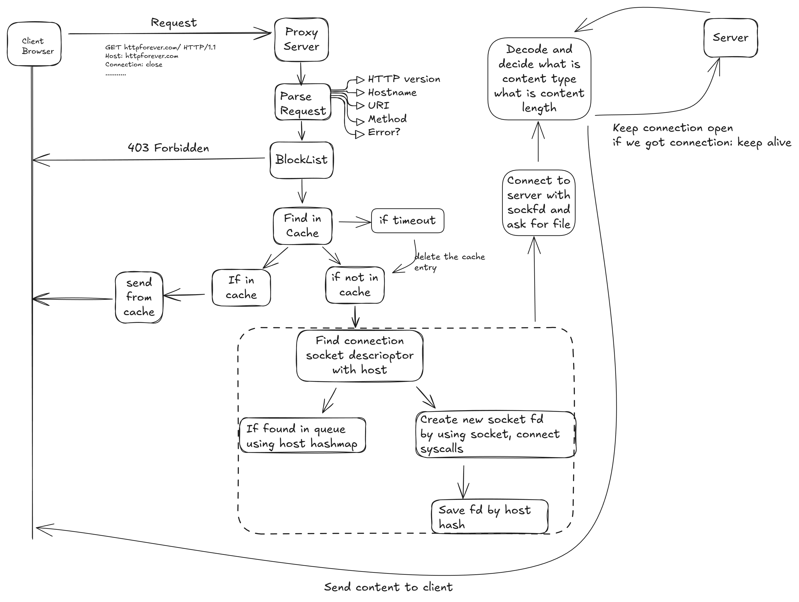
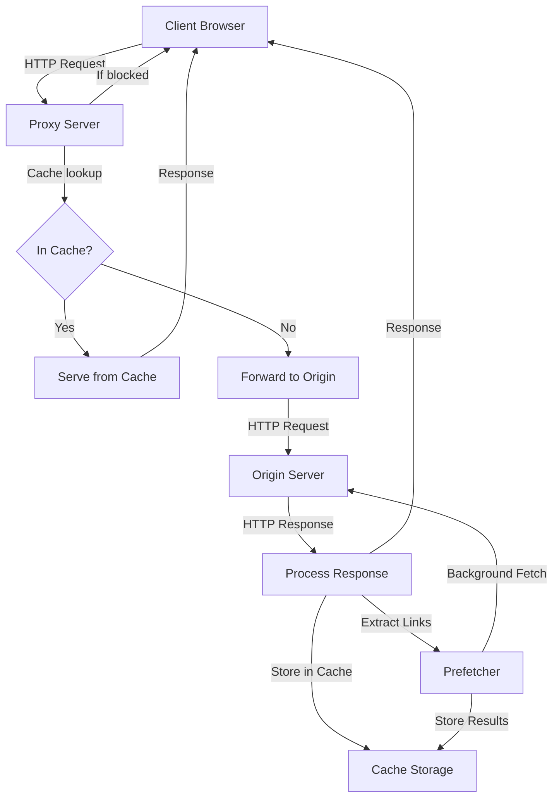
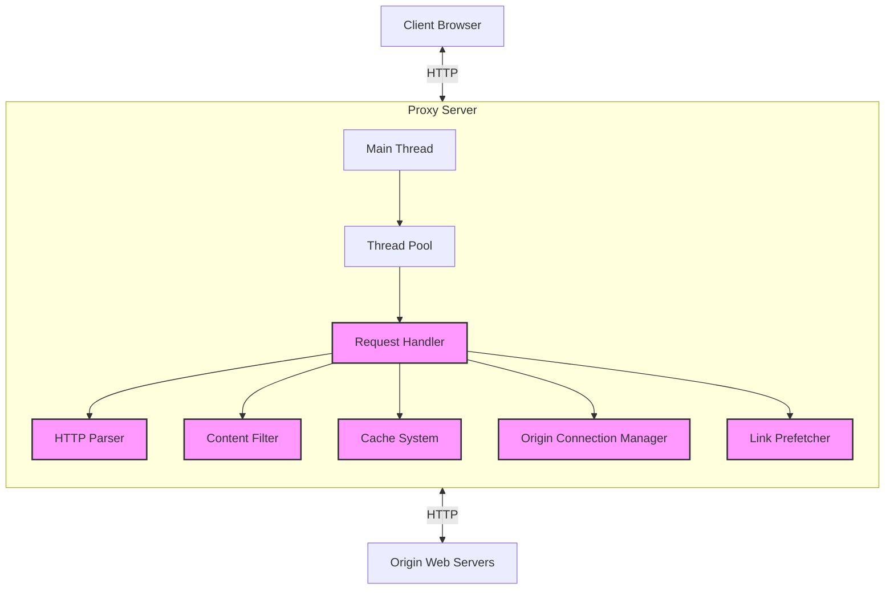
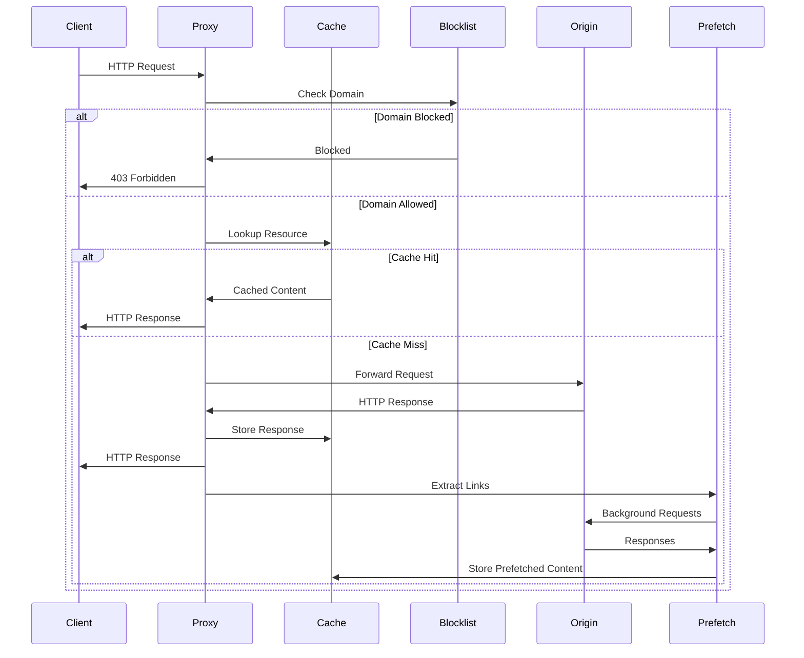
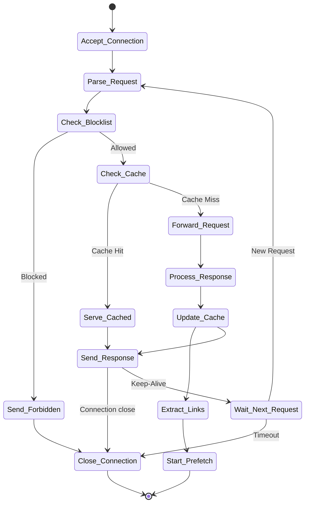

# HTTP Proxy Server

A high-performance HTTP proxy server implementation with advanced features including caching, content filtering, and prefetching.



## Overview

This HTTP proxy server acts as an intermediary between clients (web browsers) and web servers, providing enhanced functionality and performance optimizations. The proxy handles HTTP/1.0 and HTTP/1.1 protocol requests, supports multiple concurrent connections through a thread pool architecture, and implements content caching for improved performance.

## Key Features

### 1. High-Performance Architecture
- Thread pool design for efficient concurrent connection handling
- Configurable number of worker threads (default: 10)
- Persistent connection management

### 2. Content Caching
- MD5-based URL hashing for efficient cache indexing
- Configurable cache timeout settings
- Hash table implementation with collision handling
- Thread-safe cache operations

### 3. Content Filtering
- Domain blocking via blocklist patterns
- Support for wildcard patterns (using glob patterns)
- Simple text file configuration

### 4. Link Prefetching
- Extracts links from HTML responses
- Proactively fetches linked resources in background threads
- Improves subsequent page load performance

### 5. Connection Management
- Persistent connection pooling to origin servers
- Proper timeout handling

## System Architecture



## Component Diagram



## Data Flow



## Component Details

### Core Proxy Engine (proxy.c)
- Initializes server components
- Sets up signal handling for graceful shutdown
- Manages the main request acceptance loop
- Dispatches requests to worker threads

### Request Handler (handle_req.c)
- Processes HTTP requests
- Manages request forwarding
- Handles caching and filtering
- Coordinates responses

### Caching System (cache.c)
- Implements MD5-based hash table
- Manages cached content storage and retrieval
- Handles cache expiration
- Thread-safe cache operations

### Content Filter (blocklist.c)
- Loads domain patterns from configuration
- Checks request URLs against block patterns
- Uses glob pattern matching for flexibility

### Prefetching Engine (prefetch.c)
- Analyzes HTML responses for links
- Creates background threads for link fetching
- Stores prefetched content in cache

### Connection Manager (connections.c)
- Maintains connection pool to origin servers
- Implements connection reuse
- Handles timeouts and cleanup

## Getting Started

### Prerequisites
- GCC compiler
- POSIX-compliant operating system (Linux/Unix)
- pthread library
- OpenSSL for MD5 hashing

### Building
```bash
make
```

### Running
```bash
./proxy <PORT> <CACHE_TIMEOUT>
```
or
```bash
make run
```
Default port for ```make run``` is 8080!

Where:
- `PORT`: Port number to listen on
- `CACHE_TIMEOUT`: Cache entry expiration time in seconds

### Configuration

#### Blocklist Configuration
- Blocklist patterns are defined in the `blocklist` file
- Each line contains one pattern
- Wildcard patterns supported (e.g., `*.example.com`)
- rerun the program after updating blocklist file

#### Proxy Configuration
- **Browser Configuration**: Configure your web browser to use the proxy
  - In most browsers: Settings/Preferences > Network > Proxy
  - Set HTTP proxy to: `localhost:8080` (or your server IP)
  - Set port to: whatever port you specified when starting the proxy
- **Command Line Configuration**: Use `-x` flag with curl
  ```bash
  curl -x http://localhost:8080 http://example.com/
  ```
- **Environment Variables**: Set HTTP_PROXY for command-line tools
  ```bash
  export HTTP_PROXY=http://localhost:8080
  ```

#### Server Configuration Constants
The proxy server uses the following configuration constants (defined in common.h):

| Constant | Value | Description |
|----------|-------|-------------|
| `BLOCKLIST_FILE_NAME` | `./blocklist` | Path to the blocklist file |
| `CACHE_ROOT` | `./cache` | Directory for cached content |
| `MAX_SIZE` | `30720` (30KB) | Maximum buffer size |
| `USE_FORK` | `0` | Use threading instead of forking |
| `TOTAL_THREADS` | `10` | Number of worker threads |
| `MAX_THREAD_IN_POOL` | `200` | Maximum thread pool size |
| `TIMEOUT_HTTP_SEC` | `10` | Connection timeout in seconds |
| `HASH_TABLE_SIZE` | `1024` | Size of hash table for caching |

## Performance Considerations

The proxy implements several optimizations:
1. **Thread Pool**: Efficiently manages concurrent connections
2. **Content Caching**: Reduces origin server load and improves response time
3. **Connection Pooling**: Maintains persistent connections to origin servers
4. **Link Prefetching**: Proactively caches resources for faster future access
5. **Zero-copy Transfers**: Uses sendfile() for efficient file operations

## Proxy Server Request Flow



## Technical Implementation

### Threading Model
The proxy uses a thread pool model to efficiently handle multiple concurrent connections. Each client connection is dispatched to a worker thread from the pool, allowing for scalable concurrent request processing.

### Caching Mechanism
Content is cached using MD5 hashes of URLs as keys. A hash table implementation with collision resolution via linked lists provides efficient lookups. Each cached entry includes a timestamp for expiration management.

### Protocol Support
The proxy supports both HTTP/1.0 and HTTP/1.1 protocols, handling differences in connection management (persistent vs. non-persistent connections) and request/response formatting appropriately.

## Security Considerations

The proxy implements basic security features:
1. Content filtering through domain blocklists
2. Protection against proxy loops
3. Proper sanitization of request URIs
4. Timeout handling to prevent resource exhaustion

## Testing and Verification

The proxy can be tested using standard web browsers or utilities like curl:

```bash
# Configure browser proxy settings to use localhost:PORT
# Or use curl:
curl -x http://localhost:PORT http://example.com/
```

A stress testing script is also provided:
```bash
python stress.py
```

## License

This project is copyrighted © 2025 by Parth Thakkar.

## Contributing

Contributions are welcome. Please follow these steps:
1. Fork the repository
2. Create a feature branch
3. Make your changes
4. Submit a pull request

## Acknowledgements

This project was developed as part of the Network Systems course.