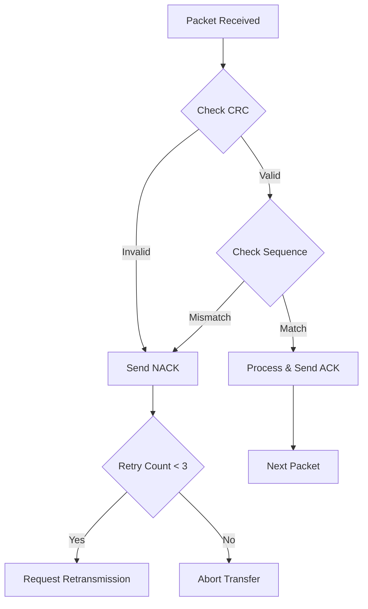

# UDP-Based FTP Client
## A Reliable File Transfer Implementation over UDP

This project implements a reliable file transfer protocol over UDP, providing guaranteed delivery through sequence numbers, CRC checks, and automatic retransmission.

## Table of Contents
1. [Features](#features)
2. [Architecture](#architecture)
3. [Protocol Details](#protocol-details)
4. [Implementation Features](#implementation-features)
5. [Installation & Usage](#installation--usage)
6. [Commands & Operations](#commands--operations)
7. [Error Handling](#error-handling)
8. [Performance & Limitations](#performance--limitations)

## Features

### Core Features
- **Reliable Data Transfer** over unreliable UDP
  - Sequence number tracking (16-bit)
  - CRC8 error detection
  - Automatic packet retransmission (max 3 attempts)
  - ACK/NACK mechanism

- **File Operations**
  - GET: Download files from server
  - PUT: Upload files to server
    - File-based mode
    - Interactive terminal mode
  - DELETE: Remove server files
  - LS: List server directory contents

- **Advanced Features**
  - Real-time terminal handling
  - Progress monitoring
  - Color-coded status messages
  - Configurable timeouts (3-100 seconds)
  - Large file support (up to 4GB theoretical)

## Architecture

### Packet Structure
```
+---------------+---------------+---------+-----------------+
| Length (2B)   | Sequence (2B) | CRC(1B) | Data (0-30KB)  |
+---------------+---------------+---------+-----------------+
     0-1            2-3            4         5-30720
```

### Protocol Constants
```c
RECEIVE_SIZE:  30KB (configurable up to 60KB)
TRANSMIT_SIZE: 30KB (configurable up to 60KB)
HEADER_SIZE:   5 bytes
TIMEOUT:       3 seconds (default)
MAX_RETRIES:   3 attempts
```

### Connection Flow
```
Client                              Server
  |                                   |
  |-------- Command Request --------->|
  |                                   |
  |<------- Initial Response ---------|
  |                                   |
  |-------- Data Transfer ----------->|
  |          (PUT/GET)                |
  |<-------- ACK/NACK ---------------|
  |                                   |
  |------- Retransmit if NACK ------>|
  |          (max 3 times)            |
```

## Protocol Details

### 1. Error Detection
- CRC8 calculation for each packet
- Pre-computed lookup table for efficiency
- Header includes length and sequence verification
```c
typedef struct {
    uint16_t length;     // Data length
    uint16_t sequence;   // Packet sequence
    uint8_t  crc;       // Error check
    uint8_t  data[];    // Variable data
} packet_t;
```

### 2. Reliability Mechanism
- Stop-and-Wait protocol
- Sequence number tracking
- Three-way error handling:
  1. CRC validation
  2. Sequence verification
  3. Timeout detection

### 3. Timeouts and Retries
- Socket-level timeout (SO_RCVTIMEO)
- Default: 3 seconds for operations
- Extended: 100 seconds for manual input
- Maximum 3 retries per packet

## Implementation Features

### 1. PUT Operation Modes
a) **File Mode**
   - Automatic file reading
   - Chunk-based transmission
   - Progress monitoring

b) **Interactive Mode**
   - Raw terminal input
   - Real-time character echo
   - Backspace support
   - ESC key termination
   ```c
   new_tio.c_lflag &= (~ICANON & ~ECHO);
   tcsetattr(STDIN_FILENO, TCSANOW, &new_tio);
   ```

### 2. GET Operation
- Creates download directory if missing
- Handles partial downloads
- Automatic file cleanup on error
- Progress display

### 3. Terminal Interface
- Color-coded status messages
- Real-time progress updates
- Error notification system
- Clear command interface

## Installation & Usage

### Prerequisites
```bash
# Required packages
gcc
make
```

### Compilation
```bash
make
```

### Running
```bash
./uftp_client <SERVER_IP> <SERVER_PORT>
```
You can get the serverip by typing hostname -I on server machine

## Commands & Operations

### Available Commands
```
get <filename>    Download file from server
put <filename>    Upload file to server
delete <filename> Remove server file
ls                List server contents
exit              Close connection
```

### Example Session
```bash
$ ./uftp_client localhost 5001

> ls
[Files listed here]

> put myfile.txt
[+] Opening file...
[+] Sending packet 1 (length: 30720)
[+] ACK received
[+] Transfer complete

> get downloaded.txt
[+] Receiving file...
[+] Download complete
```

## Error Handling

### 1. Network Errors
- Packet loss detection
- Timeout recovery
- Connection failures

### 2. File Errors
- Missing files
- Permission issues
- Disk space checks

### 3. Protocol Errors
- CRC mismatches
- Sequence mismatches
- Retry exhaustion

### Error Recovery Flow


## Performance & Limitations

### Performance Features
1. **Optimal Buffer Sizes**
   - 30KB default packet size
   - Configurable up to 60KB
   - Header overhead only 5 bytes

2. **Efficient Error Detection**
   - CRC8 with lookup table
   - Quick sequence verification
   - Immediate error notification

### Current Limitations
1. No encryption support
2. No compression
3. No resume capability
4. Single file operations only
5. Maximum file size theoretical limit: 4GB

### Future Enhancements
1. [ ] Add encryption support
2. [ ] Implement compression
3. [ ] Add transfer resume capability
4. [ ] Directory transfer support
5. [ ] Multiple simultaneous transfers

## Contributing
Feel free to create issues or submit pull requests.

## Acknowledgments
- CRC8 implementation inspired by standard algorithms
- Terminal handling based on POSIX specifications

## Author
Parth Thakkar

---