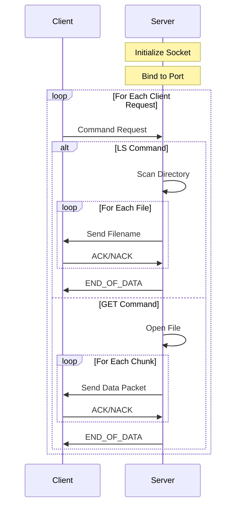
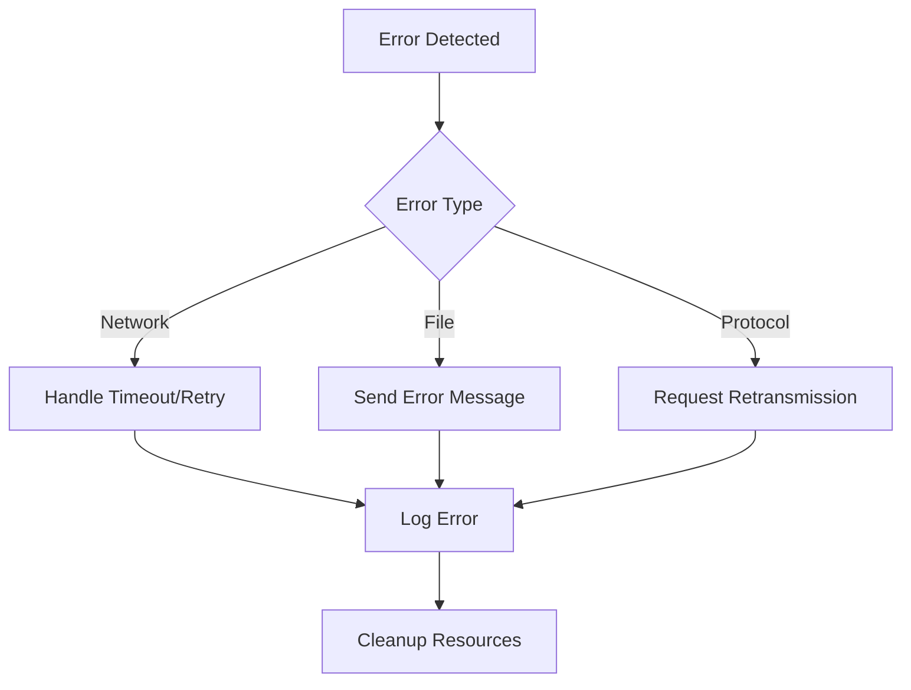

# UDP-Based FTP Server Implementation
## A Reliable File Server Over UDP

This project implements a robust UDP-based file transfer server with built-in reliability mechanisms, error detection, and comprehensive file operation support.

## Table of Contents
1. [Features](#features)
2. [Architecture](#architecture)
3. [Protocol Details](#protocol-details)
4. [Implementation Features](#implementation-features)
5. [Installation & Usage](#installation--usage)
6. [Command Handling](#command-handling)
7. [Error Management](#error-management)
8. [Performance & Security](#performance--security)

## Features

### Core Features
- **Reliable UDP Communication**
  - CRC8-based error detection
  - Sequence number tracking (16-bit)
  - Automatic packet retransmission
  - ACK/NACK protocol
  - Configurable timeouts

- **File Operations**
  - GET: Send file to client
  - PUT: Receive and store client files
  - DELETE: Remove files
  - LS: List directory contents

- **Advanced Features**
  - IPv4 and IPv6 support
  - Concurrent client handling
  - Dynamic buffer sizing
  - Port reuse capability
  - Error resilience

## Architecture

### Packet Structure
```
+---------------+---------------+---------+-----------------+
| Length (2B)   | Sequence (2B) | CRC(1B) | Data (0-30KB)  |
+---------------+---------------+---------+-----------------+
     0-1            2-3            4         5-30720
```

### Protocol Constants
```c
RECEIVE_SIZE:  30KB (configurable up to 60KB)
TRANSMIT_SIZE: 30KB (configurable up to 60KB)
HEADER_SIZE:   5 bytes
TIMEOUT:       3 seconds (default)
MAX_RETRIES:   3 attempts
PORT_RANGE:    > 5000 (security measure)
```

### Server Flow


## Protocol Details

### 1. Socket Configuration
- Supports both IPv4 and IPv6 (AF_UNSPEC)
- UDP socket type (SOCK_DGRAM)
- Address reuse enabled
- Configurable send/receive timeouts
```c
struct timeval timeout = {
    .tv_sec = 3,
    .tv_usec = 0
};
setsockopt(sockfd, SOL_SOCKET, SO_REUSEADDR, &yes, sizeof(int));
setsockopt(sockfd, SOL_SOCKET, SO_RCVTIMEO, &timeout, sizeof(timeout));
```

### 2. Error Detection
- CRC8 implementation with lookup table
- Sequence number validation
- Length field verification
- Timeout detection

### 3. Reliability Mechanism
- Stop-and-Wait protocol
- Packet acknowledgment
- Maximum 3 retry attempts
- Error notification system

## Implementation Features

### 1. File Operations
a) **Directory Listing (LS)**
   - Real-time directory scanning
   - Filename transmission with CRC
   - Progress monitoring
   - Error-resilient transfer

b) **File Retrieval (GET)**
   - Chunk-based transmission
   - Automatic retransmission
   - Progress tracking
   - Resource cleanup

c) **File Upload (PUT)**
   - File creation/truncation
   - Permission management (0644)
   - Atomic writing
   - Error handling

d) **File Deletion (DELETE)**
   - File existence verification
   - Safe deletion
   - Status notification
   - Error reporting

### 2. Protocol Messages
```c
#define END_OF_DYNAMIC_DATA "EOF\t\t\t\0"
#define ACK "ack\t\t\t\0"
#define NACK "nack\t\t\t\0"
#define ERROR_FOR_DYNAMIC_DATA "UNABLE_TO_COMPLETE_THE_OPERATION\t\t\t\n\0"
#define FILE_NOT_FOUND "FILE_NOT_FOUND\t\t\t\n\0"
```

## Installation & Usage

### Prerequisites
```bash
gcc
make
```

### Compilation
```bash
make
```

### Running
```bash
./uftp_server <PORT>  # Port must be > 5000
```

## Command Handling

### Command Flow
1. **Command Reception**
   ```c
   _recv(&sd, RECIEVE_SIZE, recieve_buffer);
   commands_t cmd = whichcmd(recieve_buffer);
   ```

2. **Command Dispatch**
   ```c
   switch (cmd) {
       case LS:    list_files(&sd); break;
       case GET:   get_file(&sd, recieve_buffer); break;
       case PUT:   put_file(&sd, recieve_buffer); break;
       case DELETE: delete_file(&sd, recieve_buffer); break;
   }
   ```

### Example Session
```bash
$ ./server 5001
[+] Server receiving UDP packets on: 0.0.0.0
[+] Received Command "ls" from IP 192.168.1.100
[Files listed...]
[+] Received Command "put file.txt" from IP 192.168.1.100
[Transfer progress...]
```

## Error Management

### 1. Network Errors
- Timeout handling
- Packet loss recovery
- Connection failures
- Address resolution errors

### 2. File Errors
- Access permissions
- Disk space
- File not found
- I/O errors

### 3. Protocol Errors
- CRC mismatches
- Sequence errors
- Invalid commands
- Buffer overflows

### Error Response Flow


## Performance & Security

### Performance Features
1. **Buffer Management**
   - 30KB default packet size
   - Configurable up to 60KB
   - Minimal header overhead (5 bytes)

2. **Error Handling**
   - Fast CRC calculation
   - Quick sequence verification
   - Efficient retry mechanism

### Security Measures
1. **Port Restrictions**
   - Enforced minimum port number (>5000)
   - Prevents privileged port usage

2. **File Operations**
   - Safe file permissions (0644)
   - Path traversal prevention
   - Resource cleanup

### Current Limitations
1. No encryption support
2. No user authentication
3. Single-threaded operation
4. Limited concurrent connections

### Future Enhancements
1. [ ] Add TLS/DTLS support
2. [ ] Implement user authentication
3. [ ] Multi-threading support
4. [ ] Connection pooling
5. [ ] File compression

## Contributing
Contributions are welcome! Please feel free to submit pull requests.

## Author
Parth Thakkar

---